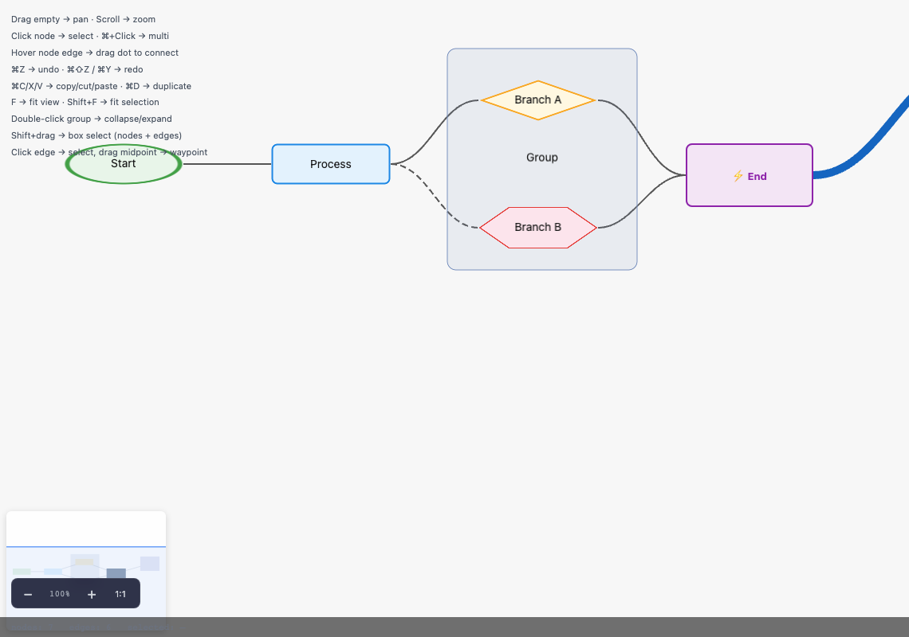
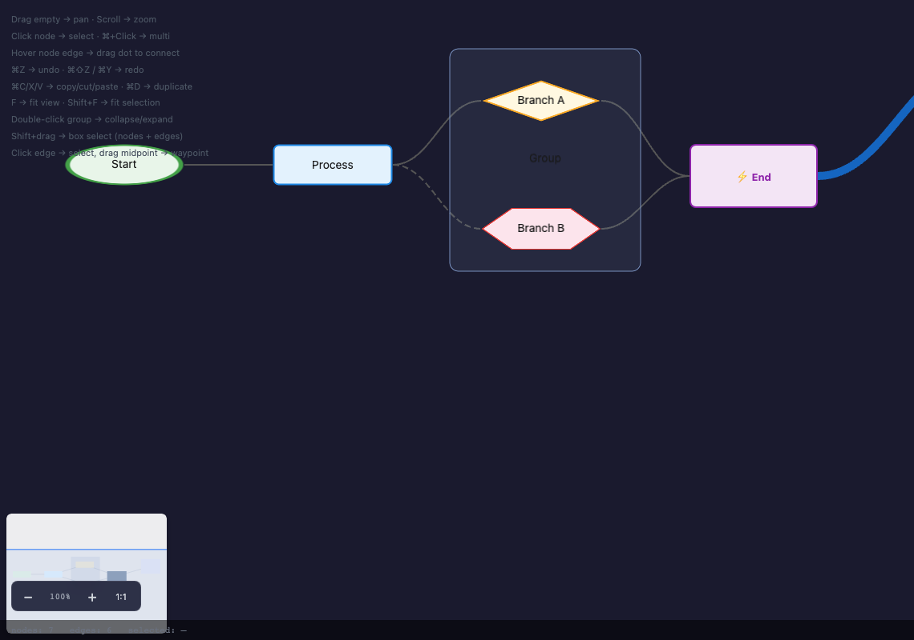

<h1 align="center">flowgl</h1>

<p align="center">
  <strong>GPU-accelerated flowchart &amp; diagram library — WebGL2, zero dependencies, framework-agnostic.</strong>
</p>

<p align="center">
  
  <a href="https://www.npmjs.com/package/@flowgl/core"></a>
  <a href="https://www.npmjs.com/package/@flowgl/react"></a>
  
  
  
</p>

<p align="center">
  <a href="https://dev.flowgl.ouranos.kr/"><strong>Live Demo</strong></a>
</p>

<p align="center">
  
</p>

---

## Why flowgl

Every other diagramming library renders to SVG or Canvas 2D — both CPU-bound and DOM-heavy. flowgl renders entirely on the GPU via WebGL2: nodes, edges, text, and minimap live in a single WebGL context. The result is smooth interaction at graph sizes that make SVG-based tools crawl.

Zero runtime dependencies. No D3. No React. No Lodash. `@flowgl/core` ships as a single ES module you own entirely.

---

## Comparison

|  | **flowgl** | react-flow | mermaid |
|---|---|---|---|
| Renderer | WebGL2 (GPU) | SVG | SVG |
| Runtime dependencies | **0** | ~6 | ~15 |
| Touch support | ✅ | ✅ | ❌ |
| Undo / redo | ✅ | ❌ built-in | ❌ |
| Group nodes (collapse/expand) | ✅ | partial | ❌ |
| Framework wrappers | React, Vue, Svelte | React only | — |
| SSR-safe | ✅ | ✅ | ✅ |

---

## Installation

```bash
# Core (framework-agnostic)
npm install @flowgl/core

# Framework wrappers
npm install @flowgl/react
npm install @flowgl/vue
npm install @flowgl/svelte
```

---

## Quick start

### Vanilla JS / TypeScript

```ts
import { FlowChart } from '@flowgl/core'

const chart = new FlowChart({
  container: document.getElementById('app')!,
  nodes: [
    { id: 'a', x: 100, y: 150, width: 140, height: 60, label: 'Ingest' },
    { id: 'b', x: 360, y: 150, width: 140, height: 60, label: 'Transform' },
    { id: 'c', x: 620, y: 150, width: 140, height: 60, label: 'Load' },
  ],
  edges: [
    { id: 'e1', source: 'a', target: 'b' },
    { id: 'e2', source: 'b', target: 'c', label: 'validated', animated: true },
  ],
  snapGrid: 20,
  minimap: { position: 'bottom-right' },
})
```

### React

```tsx
import { useState } from 'react'
import { Flowchart } from '@flowgl/react'
import type { NodeData, EdgeData } from '@flowgl/react'

const initialNodes: NodeData[] = [
  { id: 'a', x: 100, y: 150, width: 140, height: 60, label: 'Ingest' },
  { id: 'b', x: 360, y: 150, width: 140, height: 60, label: 'Transform' },
]
const initialEdges: EdgeData[] = [
  { id: 'e1', source: 'a', target: 'b', animated: true },
]

export function Pipeline() {
  const [nodes, setNodes] = useState(initialNodes)
  const [edges, setEdges] = useState(initialEdges)

  return (
    <Flowchart
      nodes={nodes}
      edges={edges}
      onNodesChange={setNodes}
      onEdgesChange={setEdges}
      style={{ width: '100%', height: '600px' }}
    />
  )
}
```

---

## Features

### Nodes



- 📐 Shape variants — rectangle, diamond, hexagon, ellipse, custom
- 🖱️ Drag & drop with snap-to-grid
- 🔲 Multi-select — Cmd+click, Shift+drag box select
- ↔️ Resize handles (4-corner)
- 🗂️ Group nodes — collapse / expand children
- 🔴 Status badges — error / warning / success / info
- 🔒 Locked nodes
- 🌐 Custom HTML content inside nodes
- 🔌 Named ports with `maxConnections` limits
- 💬 Node tooltips
- 🔤 Multi-line labels with automatic RTL detection

<br clear="right">

### Edges
- 〰️ Bezier curves, smooth GPU rendering
- 🐜 Animated edges (marching-ants)
- 🏷️ Labels at bezier midpoint
- ⚓ Waypoints — drag midpoint to add, right-click to remove
- ↩️ Endpoint rerouting by drag
- ✏️ Dashed / custom stroke styles

### Interaction
- 🖐️ Pan & zoom — mouse wheel, pinch-zoom on touch
- 📱 Full touch support (drag, connect, pan, pinch)
- ⌨️ Keyboard nav — Tab cycle, Arrow nudge (10 px), Delete
- ↩️ Undo / redo — Ctrl+Z / Ctrl+Y, configurable history depth
- 📋 Copy / cut / paste — Ctrl+C / Ctrl+X / Ctrl+V
- 🔁 Duplicate — Ctrl+D
- ✅ Select all — Ctrl+A
- 🔎 Fit view — F; fit selection — Shift+F
- 👁️ Read-only mode

### Layout & Rendering
- 🌳 Hierarchical auto-layout
- ⭕ Circular layout
- 🗺️ Minimap (configurable position & size)
- ▦ Grid background — dots or lines
- 🖼️ Export PNG / SVG
- ♿ Accessible — `role="application"`, `aria-live` announcements
- 🌐 SSR-safe — no crash in Node.js environments

---

## Framework wrappers

| Package | Status | Description |
|---|---|---|
| `@flowgl/core` | [](https://www.npmjs.com/package/@flowgl/core) | Framework-agnostic core library |
| `@flowgl/react` | [](https://www.npmjs.com/package/@flowgl/react) | `<Flowchart>` component with full controlled / uncontrolled API |
| `@flowgl/vue` | [](https://www.npmjs.com/package/@flowgl/vue) | Vue 3 `<Flowchart>` component |
| `@flowgl/svelte` | [](https://www.npmjs.com/package/@flowgl/svelte) | Svelte `<Flowchart>` component |

All wrappers are thin bindings over `@flowgl/core` — no extra runtime weight.

---

## Browser requirements

WebGL2 is required. Supported browsers:

| Browser | Minimum version |
|---|---|
| Chrome | 56+ |
| Firefox | 51+ |
| Safari | 15+ |
| Edge | 79+ |

When WebGL2 is unavailable the `onError` callback is invoked — no silent crash.

---

## License

MIT © [Deiamor](https://github.com/Deiamor)


